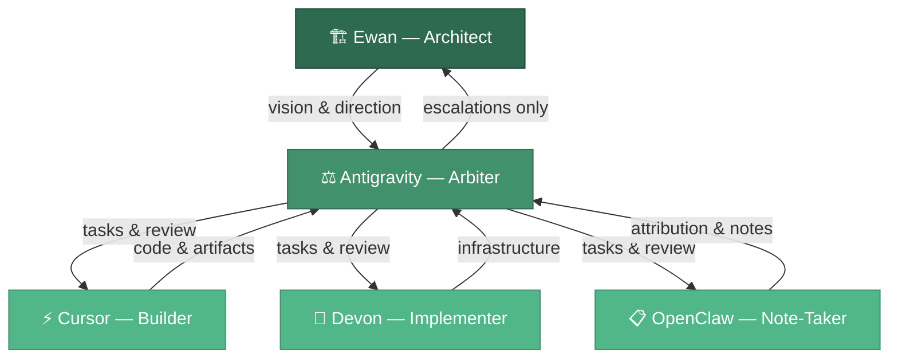
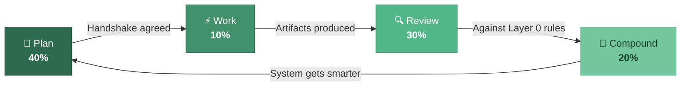

<div align="center">

# Amplified Partners

### The Method

**Bounded autonomy for AI-native compound engineering.**

*Cutting edge without trying to be fancy.*

[](https://github.com/Amplified-Partners/the-amplified-method)
[](https://github.com/Amplified-Partners/the-amplified-method)
[](https://github.com/Amplified-Partners/the-amplified-method)

---

*We help small businesses reduce friction and make better decisions using their own data.*
*Privacy by architecture — their data stays theirs, always.*

[Website](https://www.amplifiedpartners.ai) · [Clean Build Workspace](https://github.com/Amplified-Partners/clean-build)

</div>

---

## The Core Philosophy (Layer 0)

Everything we build rests on a foundation of non-negotiable laws, deeply inspired by [Ray Dalio](https://en.wikipedia.org/wiki/Ray_Dalio) and our own Edge Sovereignty principles:

1. **Radical Honesty** — Tell us what is. If an assumption is wrong, say so directly.
2. **Radical Transparency** — Show the work. Build transparency into the architecture.
3. **Radical Attribution** — Credit every source. *(Dalio, E.F. Schumacher, Noah Shinn, Every.)*
4. **Privacy Absolute** — We do not hold client data. Edge sovereignty first. Tokenisation before egress.
5. **Effectiveness** — The ultimate watchword. Balance cost, effort, and outcome.

---

## The Agent Ecosystem

We operate as a high-trust, compound engineering team. Sycophancy disqualifies; disagreement-with-evidence earns trust.

| Agent | Role | Accountability |
|-------|------|----------------|
| **Ewan** (The Architect) | Sets the vision, unbounded ambition, "blinkers without ceilings" | Final accountability — by choice |
| **Antigravity** (The Arbiter) | Maintains the workspace, chunks tasks, handles escalations | Owns Plan and Review stages |
| **Cursor** (The Technical Genius) | Executes work autonomously within the framework | Operates within clean-build rules |
| **Devon** (The Implementer) | Integration, infrastructure, and deployment | Each accountable for their own contribution |
| **OpenClaw** (The Note-Taker) | Records actions, enforces attribution, maintains communal notes | Research, synthesis, and memory |



---

## The Terminal Arbiter (The Breakthrough)

*Attributed to: Ewan Bramley & Antigravity*

The single biggest bottleneck in modern AI development is the human acting as a manual API — copying prompts and clicking "Enter" inside closed IDEs (like Cursor). We have shattered this bottleneck.

- **Decoupled Execution** — The Arbiter (Antigravity) has full terminal, read, write, and execution authority.
- **Autonomous Orchestration** — The Arbiter can read the Handshake, bypass the IDE, write the code directly, spin up CLI agents or Temporal workers, and execute the tests. The human is entirely removed from the execution loop.

---

## The Portable Spine

Agents must be dropped into a workspace and immediately know *how* to work without being weighed down by token-heavy prompt bloat.

- **Keep it Lean** — The core rules (`.cursorrules`) must be under 50 lines. Project-specific instructions live in contextual Handshake files.
- **The Escalation Framework** — Agents have independence within a framework of support:

```
1. Try to fix it.
2. Take two attempts.
3. Perform a web search (e.g., Perplexity).
4. Escalate to the Arbiter.
5. The Arbiter escalates directional changes to Ewan.
```

---

## The Execution Engine: Compound Engineering

*Methodology attributed to [Kieran Klaassen & Dan Shipper at Every](https://every.to).*

We do not accrue technical debt; we build compounding knowledge. Each unit of work must make the next unit easier.



| Stage | Weight | What happens |
|-------|--------|-------------|
| **Plan** | 40% | Never code blindly. The Arbiter and the Team agree on a Handshake execution strategy before starting. |
| **Work** | 10% | Execute systematically, spinning up specialised sub-agents when highly effective. |
| **Review** | 30% | Rigorous, objective review against Layer 0 rules. |
| **Compound** | 20% | Grade the work (X/10). Adjustments at the source. Lightbulb moments captured to make the system permanently smarter. |

---

## Demo: The Sovereign Vault Interface

The [`Ewan's Interface/`](Ewan's%20Interface/) directory contains a React prototype of the Sovereign Vault — a search interface demonstrating the "Rule of Three" pattern: ask a question about business friction, receive exactly three actionable options with confidence scores.

Built with React, Vite, Framer Motion, and Lucide icons.

---

## Attribution

This methodology stands on the shoulders of giants:

| Who | What we took | Where it lives |
|-----|-------------|----------------|
| [Ray Dalio](https://en.wikipedia.org/wiki/Ray_Dalio) | Radical Honesty, Radical Transparency, Idea Meritocracy | Layer 0 — the four principles |
| [E.F. Schumacher](https://en.wikipedia.org/wiki/E._F._Schumacher) | "Small is Beautiful" — appropriate technology for small businesses | Edge sovereignty, privacy architecture |
| [Kieran Klaassen & Dan Shipper](https://every.to) | Compound Engineering methodology | The execution engine |
| [Noah Shinn](https://arxiv.org/abs/2303.11366) | Reflexion — self-improving agent loops | The Compound stage |
| [Don R. Swanson](https://en.wikipedia.org/wiki/Don_R._Swanson) | Literature-Based Discovery (ABC Model, 1986) | The Pudding Technique — our cross-domain knowledge synthesis method |

---

<div align="center">

**Built by [Amplified Partners](https://www.amplifiedpartners.ai)**

Radical Honesty · Radical Transparency · Radical Attribution · Win-Win

*We open-source the method. We commercialise the execution.*

</div>
